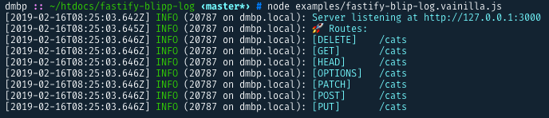

# fastify-blipp-log

Prints your routes to the console (using internal or custom a log) each time your server starts.
(inspired by [fastify-blipp](https://github.com/PavelPolyakov/fastify-blipp) fastify-blipp plugin and [blipp](https://github.com/danielb2/blipp) hapijs plugin)

## install

```
npm i fastify-blipp-log
```

## usage

It is important to register the plugin as soon as possible, so it starts to listen for the new routes.

```javascript
const prettyRoutes = require('fastify-blipp-log').default
const fastify = require('fastify')({
    logger: {
        prettyPrint: { colorize: true }
    }
})

fastify.register(prettyRoutes)

fastify.all('/cats', async () => ({}))

const start = async () => {
    try {
        await fastify.listen(3000)
        fastify.prettyPrintRoutes()
    } catch (err) {
        console.error(err)
        process.exit(1)
    }
}

start()
```

## Output



## Options

-   `customLogger` : You can pass a custom logger instance, by default it uses fastify logger. Optional
-   `tabLength`: Change the tab size between the method and the route, by default is 13. Optional

## Credits

I couldn't do this without this awesome libraries, so thanks to all:

-   fastify-blipp plugin: [fastify-blipp](https://github.com/PavelPolyakov/fastify-blipp)
-   hapijs plugin: [blipp](https://github.com/danielb2/blipp)

## License

Licensed under the ISC license. 2019
